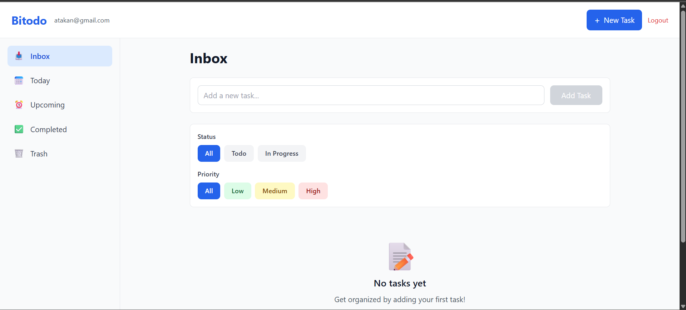
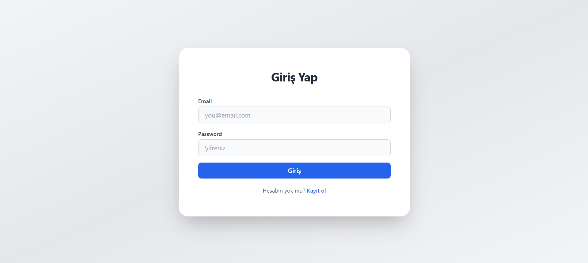
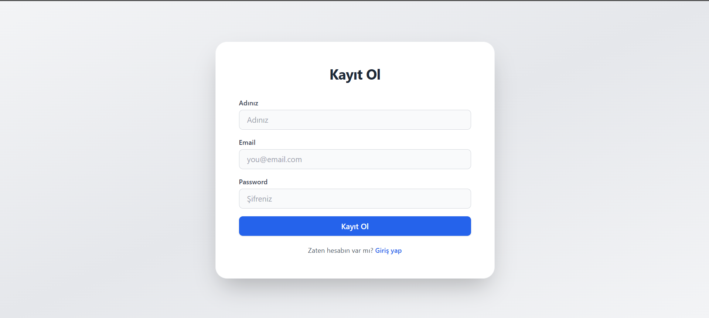

# Bitodo


# Bitodo

Bitodo, modern ve kullanıcı dostu bir yapılacaklar uygulamasıdır. Her kullanıcının kendi todo listesini yönetebileceği, hızlı ve güvenli bir backend ile React tabanlı frontend sunar.

## Ekran Görüntüleri

Aşağıda uygulamanın temel ekran görüntülerini bulabilirsiniz:

## ANA SAYFA



## LOGIN VE REGISTER




## Kurulum

1. Repoyu klonlayın:
   ```sh
   git clone https://github.com/Syncrof/Bitodo.git
   ```
2. Ana dizinde backend ve frontend klasörlerinde bağımlılıkları yükleyin:
   ```sh
   cd Bitodo/backend && npm install
   cd ../frontend && npm install
   ```
3. Backend'i başlatın:
   ```sh
   npm start
   ```
4. Frontend'i başlatın:
   ```sh
   npm start
   ```

## Özellikler
- Kullanıcıya özel todo listesi
- Adım ve not desteği
- Modern arayüz
- Hızlı ve güvenli API

## Katkı
Katkı sağlamak için pull request açabilirsiniz.

---

Bitodo © 2025
```

## ⚙️ Kullanılan Teknolojiler

- React
- React Router
- Tailwind CSS
- Context API
- TypeScript & JavaScript

## 📂 Proje Yapısı

Kısa bir dosya/folder yapısı örneği:

```
frontend/
├── src/
│   ├── components/
│   ├── context/
│   ├── pages/
│   ├── services/
│   ├── styles/
│   ├── App.js
│   ├── index.js
│   └── ...
├── public/
└── ...
```

## 👤 Katkıda Bulunma

1. Fork'la ve yeni bir branch oluştur.
2. Değişikliklerini yap ve commit et.
3. Pull request gönder.


