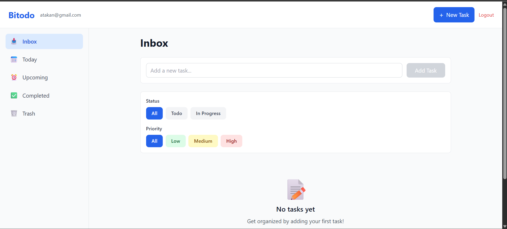
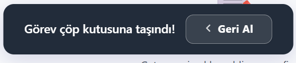
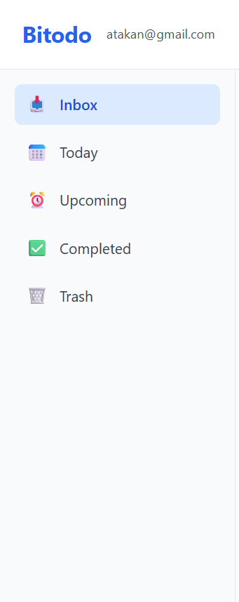
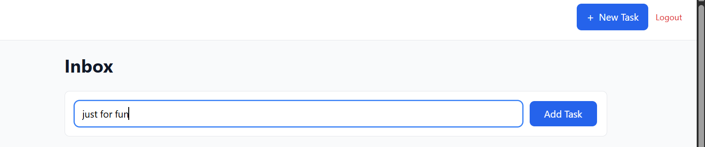
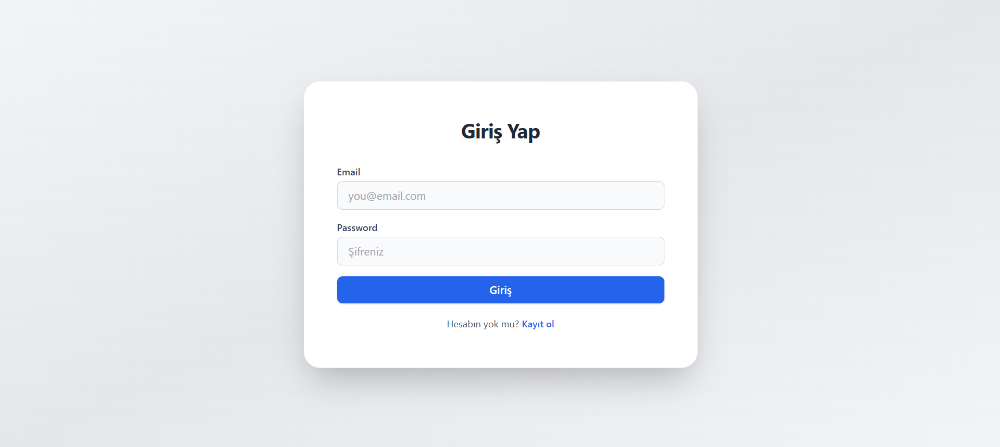
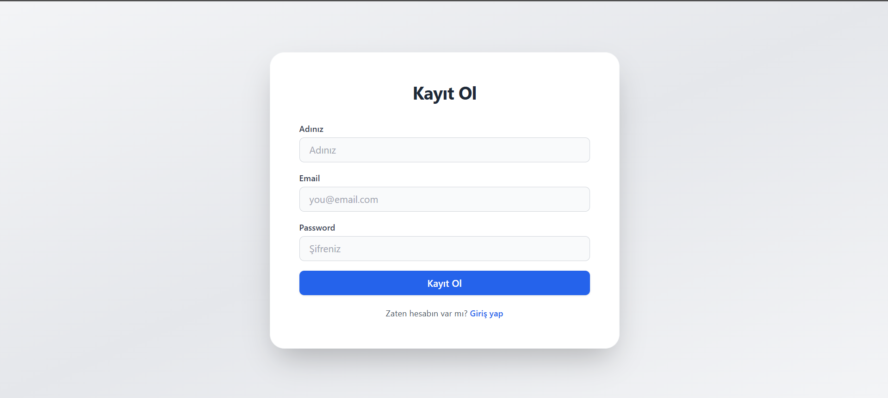

# Bitodo

## 📝 Proje Tanımı

Bitodo, modern ve erişilebilir bir yapılacaklar uygulamasıdır. Kullanıcı dostu arayüzü, bildirim sistemi, hızlı task yönetimi ve sezgisel navigasyonuyla öne çıkar.

## 🚀 Özellikler

- Modern ve responsive arayüz (React + Tailwind CSS)
- Bildirim (toast) sistemi ve animasyonlu sidebar uyarıları
- Task ekleme, silme, geri alma (undo), arşivleme ve geri getirme
- Oturum açma/kayıt olma (authentication)
- React Router ile hızlı sayfa geçişleri
- Erişilebilirlik ve klavye desteği
- Temiz ve okunabilir kod yapısı

## 📸 Ekran Görüntüleri

1. **Ana Sayfa / Task Listesi**  
   
   

2. **Bildirim (Toast) Sistemi**  
   


3. **Sidebar ve Badge Uyarısı**  
   


4. **Task Ekleme ve Geri Al (Undo) Butonu**  
   


4. **Giriş Sayfası  / Register Sayfası**  
    


    


## 🛠️ Kurulum

```bash
git clone https://github.com/SENIN_KULLANICI_ADIN/Bitodo.git
cd Bitodo/frontend
npm install
npm start
```

## ⚙️ Kullanılan Teknolojiler

- React
- React Router
- Tailwind CSS
- Context API
- TypeScript & JavaScript

## 📂 Proje Yapısı

Kısa bir dosya/folder yapısı örneği:

```
frontend/
├── src/
│   ├── components/
│   ├── context/
│   ├── pages/
│   ├── services/
│   ├── styles/
│   ├── App.js
│   ├── index.js
│   └── ...
├── public/
└── ...
```

## 👤 Katkıda Bulunma

1. Fork'la ve yeni bir branch oluştur.
2. Değişikliklerini yap ve commit et.
3. Pull request gönder.


